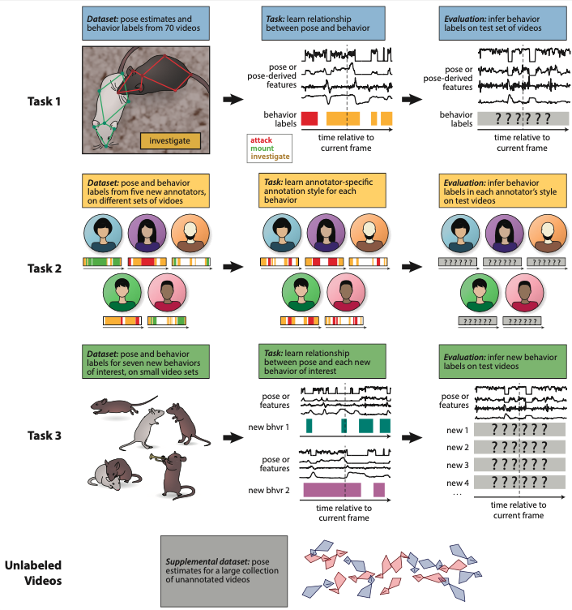

# CalMS21 Dataset Baselines 
This baseline was developed by AICrowd for the Multi-Agent Behavior (MABe) Challenge at CVPR 2021.

|  | 
|:--:| 
| A visual description of the tasks in the CalMS21 Dataset |


Code for the baseline experiments in the CalMS21 Dataset.

# Getting Started

The baselines are simple with minimal requirements. To get started run the following commands.

```shell
git clone http://gitlab.aicrowd.com/aicrowd/research/mab-e/mab-e-baselines.git
cd mab-e-baselines
pip install -r requirements.txt
```
## Quick Data Setup

You can download the data at the CalMS21 data source: [https://data.caltech.edu/records/1991](https://data.caltech.edu/records/1991).
The original dataset is formatted as json files.
Note that the baseline code does not use the unlabeled videos set.

Run the conversion script `calms21_convert_to_npy.py` provided in the [data repo](https://data.caltech.edu/records/1991) to convert the json files into the baseline npy format.

The data folder should look like:
```
data  - Create this folder in this directory
├──calms21_task1_train.npy
├──calms21_task1_test.npy
├──calms21_task2_train.npy
├──calms21_task2_test.npy
├──calms21_task3_train.npy
└──calms21_task3_test.npy
```

Alternatively, a version of the data, with behaviors and sequence names anonymized, was released for the MABe challenge.
This data (train split) is available from the [AICrowd challenge page](https://www.aicrowd.com/challenges/multi-agent-behavior-representation-modeling-measurement-and-applications)

# Running The Code

To run the baselines run the following commands

```shell
python train_task1.py
python train_task2.py
python train_task3.py
```

We also provide code for different experiments that vary the architecture and other parameters. These are available in `configs/task1_experiments.py` You can run them with the following command.

```shell
python train_task1_all_experiments.py
```

# Folder Structure

```
├── train_task1.py                - Entrypoint for training task1 baseline
├── train_task2.py                - Entrypoint for training task2 baseline
├── train_task3.py                - Entrypoint for training task3 baseline
├── train_all_experiments.py      - Entrypoint for training all the runs including baselines
├── train_task1_hparams.py        - For training task 1 with cli arguments for hyperparameters  
│  
├── configs                       - Contains baseline and experiment configs
│   ├── task1_baseline.py         - 1D Convolution baseline
│   ├── task2_baseline.py         - 1D Conolution on task 2 with pretrained model of task 1
│   ├── task3_baseline.py         - 1D Conolution on task 3 with pretrained model of task 1
│   └── experiments.py            - Training other architectures and experiments
│
├── data_generator
│   └── mab_e_data_generator.py   - Temporal window generator for training
│
├── trainers 
│   └── mab_e_trainer.py          - Training setup and run manager
│
└── utils
     ├── config.py                - Functions for parsing the config files.
     ├── load_data.py             - Loads the challenge data
     ├── save_results.py          - Save models and validation metrics
     ├── preprocessing.py         - Normalize and other preprocessing
     ├── split_data.py            - Split data into training and validation
     ├── seeding.py               - Seeding functions for reproducibility
     ├── dirs.py                  - Functions for creating directories.
     └── args.py                  - Functions for parsing arguments.
```

# Resources

|  | 
|:--:| 
| Different neural net architectures used for Task 1 experiments |

## CalMS21 Dataset paper

[The Multi-Agent Behavior Dataset: Mouse Dyadic Social Interactions](https://arxiv.org/abs/2104.02710)

## MABe Challenge Page

[AIcrowd - Multi-Agent Behavior: Representation, Modeling, Measurement, and Applications](https://www.aicrowd.com/challenges/multi-agent-behavior-representation-modeling-measurement-and-applications)

# Cite

```
@misc{sun2021multiagent,
      title={The Multi-Agent Behavior Dataset: Mouse Dyadic Social Interactions}, 
      author={Jennifer J. Sun and Tomomi Karigo and Dipam Chakraborty and Sharada P. Mohanty and David J. Anderson and Pietro Perona and Yisong Yue and Ann Kennedy},
      year={2021},
      eprint={2104.02710},
      archivePrefix={arXiv},
      primaryClass={cs.LG}
}
```